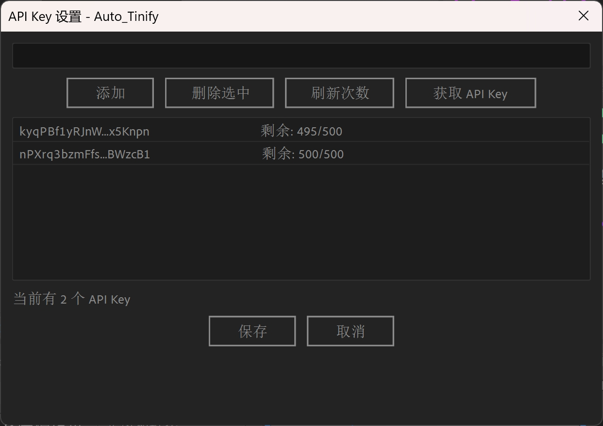
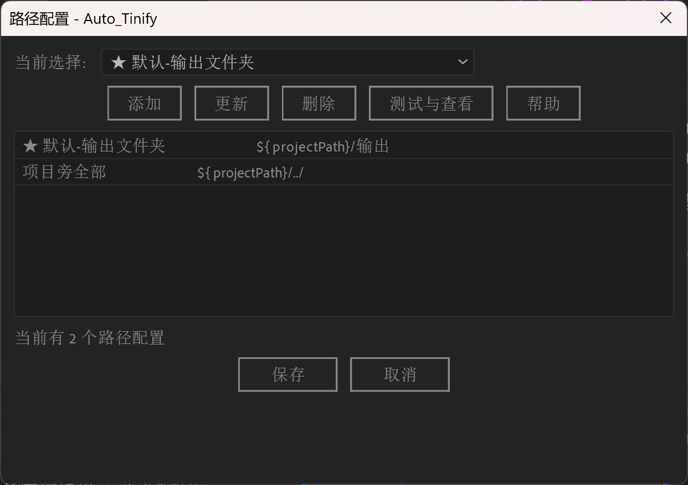

#  Auto_Tinify

> 主打简单快捷的After Effects图片压缩工具

---

## 馨介

Auto_Tinify 是一款专为 After Effects 设计的图片压缩工具，通过 Tinify API 提供高效、智能的图片压缩服务。支持批量压缩、多API Key轮换、自定义路径配置等强大功能，帮助您轻松优化项目中的图片资源。

## 主要特点

- 馃殌 **智能压缩**：使用 Tinify API 压缩图片（JPG、PNG、WebP）
- 馃攽 **多密钥支持**：支持多个 API Key 轮换，自动追踪剩余次数
- 馃搧 **灵活路径**：支持路径配置，使用 ${projectPath} 变量
- 鈿? **快捷操作**：
  - Ctrl+Shift 点击：压缩选中的图片文件
  - Alt + 点击：直接替换原图
- 馃搳 **实时监控**：显示剩余使用次数和当前路径
- 馃摑 **日志记录**：完整的操作日志记录
- 馃寑 **配置持久化**：自动保存配置文件到脚本旁边，无需重复设置
- 馃寪 **项目集成**：直接选择项目中的图片进行压缩，无需手动复制文件

## 安装方法

### 方法1：手动安装

1. 下载 public 文件夹中的**最新版本** .jsxbin 文件
2. 将文件复制到 After Effects 的脚本目录：
   - **Windows**: C:\Program Files\Adobe\Adobe After Effects [版本]\Support Files\Scripts\
   - **Mac**: /Applications/Adobe After Effects [版本]/Scripts/
3. 重启 After Effects
4. 在 Window 菜单中找到脚本

### 方法2：使用脚本面板

1. 在 After Effects 中，选择 Window 鈫?Extensions 鈫?Extensions ScriptUI Panels
2. 拖拽 .jsxbin 文件到脚本面板
3. 脚本会自动加载

## 使用指南

### 首次使用

#### 1. 获取 API Key

- 访问 [Tinify 官网](https://tinify.com/developers)
- 注册账号并获取免费的 API Key
- 每月免费 500 次压缩

#### 2. 配置 API Key

点击主面板的 "API Key 设置" 按钮：

**操作步骤**：
1. 点击 "添加 API Key"
2. 输入你的 API Key
3. 点击 "确定" 保存
4. 脚本会自动查询剩余次数

**支持多个 API Key**：可以添加多个 Key，脚本会自动轮换使用

#### 3. 配置压缩路径

点击 "路径配置" 按钮：

**支持变量**：
- ${projectPath}：项目文件所在的父目录

**示例配置**：
- ${projectPath}/输出：输出到项目目录下的"输出"文件夹
- ${projectPath}/compressed：输出到项目目录下的"compressed"文件夹

**自定义路径**：可以直接输入绝对路径，如 D:/MyProject/images

### 日常使用

#### 基本压缩

1. 点击 "开始压缩" 按钮
2. 脚本会自动压缩项目中的图片
3. 压缩后的文件会保存到配置的路径

**界面说明**：
- 状态栏：显示剩余次数和当前输出路径
- 压缩进度：实时显示压缩进度
- 快捷操作：支持鼠标悬停查看详细信息

#### 快捷操作

| 操作 | 方法 | 说明 |
|------|------|------|
| 压缩选中文件 | 按住 Ctrl+Shift 点击 "开始压缩" | 仅压缩选中的图片文件 |
| 直接替换原图 | 按住 Alt 点击 "开始压缩" | 压缩后直接替换原文件 |
| 查看日志 | 点击 "日志" 按钮 | 查看详细的操作记录 |
| 查看帮助 | 点击 "?" 按钮 | 查看使用说明 |

### 高级功能

#### 项目图片直接压缩

无需手动复制文件，直接在 After Effects 项目中选择图片：

1. 在项目面板中选中图片文件
2. 按住 Ctrl+Shift 点击 "开始压缩"
3. 脚本会自动处理选中的图片

#### 配置文件自动保存

所有配置（API Key、路径设置等）会自动保存到脚本旁边的配置文件：
- 配置文件位置：脚本目录下的 uto_tinify_config.txt
- 无需重复设置，下次使用自动加载

## 配置说明

### API Key 管理

**添加新 Key**：
1. 点击 "API Key 设置"
2. 点击 "添加 API Key"
3. 输入 Key，点击 "确定"

**查看剩余次数**：
- 状态栏实时显示剩余次数
- 格式：剩余 995/1000|路径：xxx

**删除 Key**：
1. 在列表中选中要删除的 Key
2. 点击 "删除" 按钮

### 路径模式

**使用变量**：
`
/compressed
/assets/optimized
`

**使用绝对路径**：
`
D:/Projects/images/compressed
C:/My Documents/AfterEffects/Output
`

## 常见问题

### Q: 压缩失败怎么办？

A: 请检查：
1. API Key 是否有效
2. 网络连接是否正常
3. Tinify API 是否正常工作
4. 图片格式是否支持（JPG、PNG、WebP）

### Q: 如何查看压缩历史？

A: 点击 "日志" 按钮，可以查看详细的操作记录，包括：
- 压缩时间
- 文件路径
- 压缩结果
- 错误信息

### Q: 支持哪些图片格式？

A: 支持 JPG、PNG、WebP 格式

### Q: 免费额度用完了怎么办？

A: 可以在 [Tinify 定价页面](https://tinify.com/pricing) 查看付费方案

### Q: 配置文件保存在哪里？

A: 配置文件自动保存在脚本同目录下的 uto_tinify_config.txt，无需手动管理

### Q: 可以批量压缩多个项目吗？

A: 可以。打开不同的项目，脚本会根据当前项目的 ${projectPath} 自动调整输出路径

## 更新日志

查看 [更新日志](更新日志.md) 了解最新功能和修复。

## 资源文件

ssets 文件夹包含：
- 界面截图
- 使用说明图片
- Logo 资源

## 技术支持

- Tinify API 文档：https://tinify.com/developers/reference
- GitHub Issues：https://github.com/yancongya/auto_tinify/issues
- 更新日志：[查看详细更新记录](更新日志.md)

## 贡献

欢迎提交 Issue 和 Pull Request！

## 许可证

MIT License - 详见 LICENSE 文件

---

**注意**：本工具需要 Tinify API Key 才能使用。请遵守 Tinify 的服务条款。

**[鈫? 返回顶部](#-auto_tinify)**

Made with 馃攽 by [yancongya](https://github.com/yancongya)

