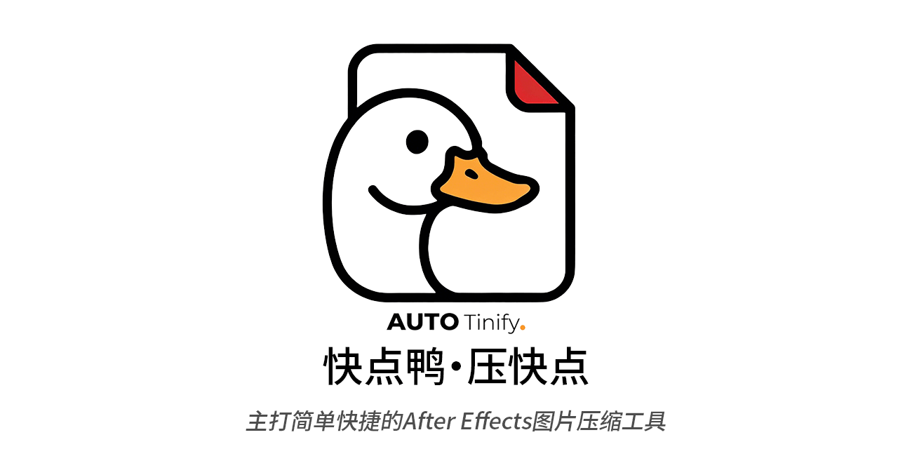
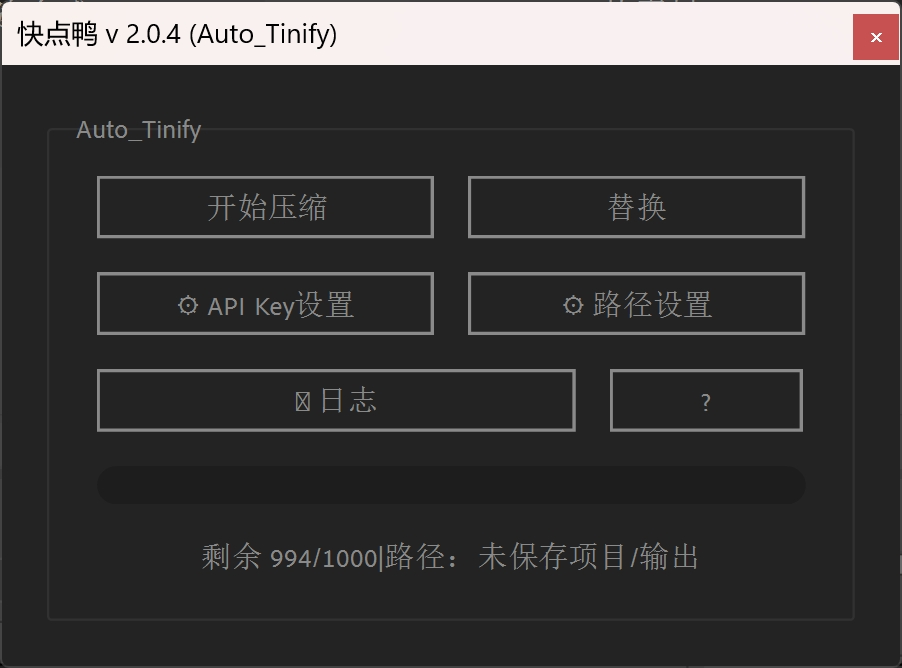
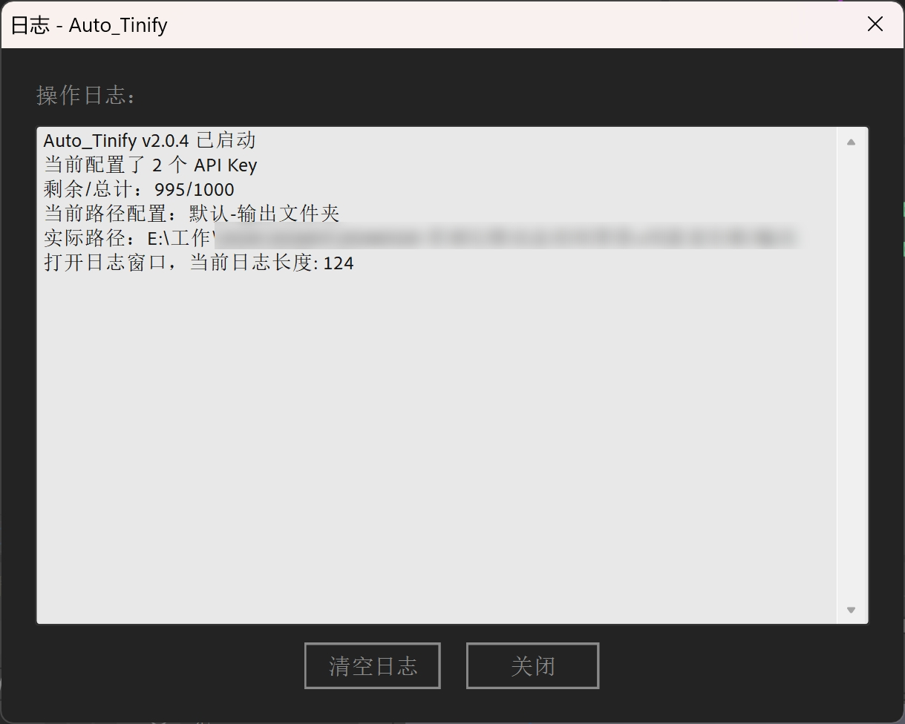

#  Auto_Tinify

> 主打简单快捷的 After Effects 图片压缩工具

---

## 介绍

Auto_Tinify 是一款专为 After Effects 设计的图片压缩工具，通过 Tinify API 提供高效、智能的图片压缩服务。支持批量压缩、多 API Key 轮换、自定义路径配置等强大功能，帮助您轻松优化项目中的图片资源。

## 主要特点

- 🧠 **智能压缩**：使用 Tinify API 压缩图片（JPG、PNG、WebP）
- 🔑 **多密钥支持**：支持多个 API Key 轮换，自动追踪剩余次数
- 🎯 **灵活路径**：支持路径配置，使用 `${projectPath}` 变量
- ⚡ **快捷操作**：
  - `Ctrl+Shift` 点击：压缩选中的图片文件
  - `Alt` 点击：直接替换原图
- 📊 **实时监控**：显示剩余使用次数和当前路径
- 📝 **日志记录**：完整的操作日志记录
- 💾 **配置持久化**：自动保存配置文件，无需重复设置
- 📁 **项目集成**：直接在 AE 项目中选择图片进行压缩

## 快速开始

### 1. 安装

**方法 1：手动安装**

1. 下载 `public` 文件夹中的最新版本 `.jsxbin` 文件
   - 网盘下载：[123网盘下载](https://www.123865.com/s/FQvajv-z4EnH?pwd=zIXS)
2. 复制到 After Effects 脚本目录：
   - **Windows**: `C:\Program Files\Adobe\Adobe After Effects [版本]\Support Files\Scripts\`
   - **Mac**: `/Applications/Adobe After Effects [版本]/Scripts/`
3. 重启 After Effects，在 `Window` 菜单中找到脚本

**方法 2：使用脚本面板**

1. 在 After Effects 中，选择 `Window` → `Extensions` → `Extensions ScriptUI Panels`
2. 拖拽 `.jsxbin` 文件到脚本面板

**方法 3：使用 kbar 脚本管理器（强烈推荐）**

1. 安装 [kbar]([KBar 3 中文文档](https://kbar.itycon.cn/)) 脚本管理器
2. 在 kbar 中搜索 `Auto_Tinify`
3. 点击安装即可

> 💡 **推荐使用方法 3**，kbar 会自动处理安装路径和版本更新，省时省力。

### 2. 获取 API Key

访问 [Tinify 官网](https://tinify.com/developers) 注册账号并获取免费 API Key（每月免费 500 次）

### 3. 配置

- **API Key 设置**：点击主面板 `⚙ API Key 设置` 按钮，添加你的 API Key
- **路径配置**：点击 `⚙ 路径设置` 按钮，配置压缩输出路径
- 所有配置都会保存在脚本旁边的配置文件中，方便随时备份

### 4. 开始压缩

点击 `开始压缩` 按钮即可

---

## 使用指南

### 快捷操作

| 操作                     | 方法                  | 说明                     |
| ------------------------ | --------------------- | ------------------------ |
| 压缩选中项目中的图片文件 | `Ctrl+Shift` + 点击 | 仅压缩选中的图片文件     |
| 直接替换原图             | `Alt` + 点击        | 用于压缩后直接替换原文件 |
| 查看日志                 | 点击 `📋` 按钮      | 查看详细操作记录         |
| 查看帮助                 | 点击 `?` 按钮       | 查看使用说明             |

### 压缩路径配置

**支持正则表达式进行控制需要自动自动压缩的目录**：

- `${projectPath}`：项目文件所在的父目录

**示例**：

- `${projectPath}/输出`：压缩到项目目录怕旁边的"输出"文件夹
- `${projectPath}/compressed`：压缩到项目目录怕旁边的压缩到输出到项目目录下的"compressed"文件夹
- `D:/MyProject/images`：绝对路径
- 推荐直接复制prompt给ai进行生成正则表达式

### 界面说明

- **状态栏**：显示剩余次数和当前输出路径
- **压缩进度**：实时显示压缩进度

---

## 配置说明

### API Key 管理

- **添加**：点击 `API Key 设置` → `添加 API Key` → 输入 Key → `确定`
- **查看剩余次数**：状态栏显示格式 `剩余 995/1000 | 路径：xxx`
- **删除**：在列表中选中 Key → 点击 `删除`

### 配置文件

所有配置自动保存在 `auto_tinify_config.txt`（脚本同目录），包括：

- API Key 及剩余次数
- 路径配置

---

## 常见问题

### Q: 压缩失败怎么办？

请检查：

1. API Key 是否有效
2. 网络连接是否正常
3. 图片格式是否支持（JPG、PNG、WebP）

### Q: 免费额度用完了怎么办？

可以在 [Tinify 定价页面](https://tinify.com/pricing) 查看付费方案

### Q: 支持哪些图片格式？

JPG、PNG、WebP

### Q: 可以批量压缩多个项目吗？

可以。脚本会根据当前项目的 `${projectPath}` 自动调整输出路径

---

## 更新日志

查看 [更新日志](更新日志.md) 了解完整更新历史和最新版本信息。

---

## 技术支持

- 📖 [Tinify API 文档](https://tinify.com/developers/reference)
- 🐛 [GitHub Issues](https://github.com/yancongya/auto_tinify/issues)
- 📝 [更新日志](更新日志.md)

## 贡献

欢迎提交 Issue 和 Pull Request！

## 许可证

MIT License - 详见 LICENSE 文件

---

> **注意**：本工具需要 Tinify API Key 才能使用，请遵守 Tinify 的服务条款。

---

## 支持作者

如果这个脚本对你有帮助，欢迎请作者喝杯咖啡 ☕️

  <table>
    <tr>
      <td align="center">
         
        <b>微信</b>
      </td>
      <td align="center">
         
        <b>支付宝</b>
      </td>
    </tr>
  </table>

---

**[⬆ 返回顶部](#-auto_tinify)**

Made with 🔑 by [yancongya](https://github.com/yancongya)

